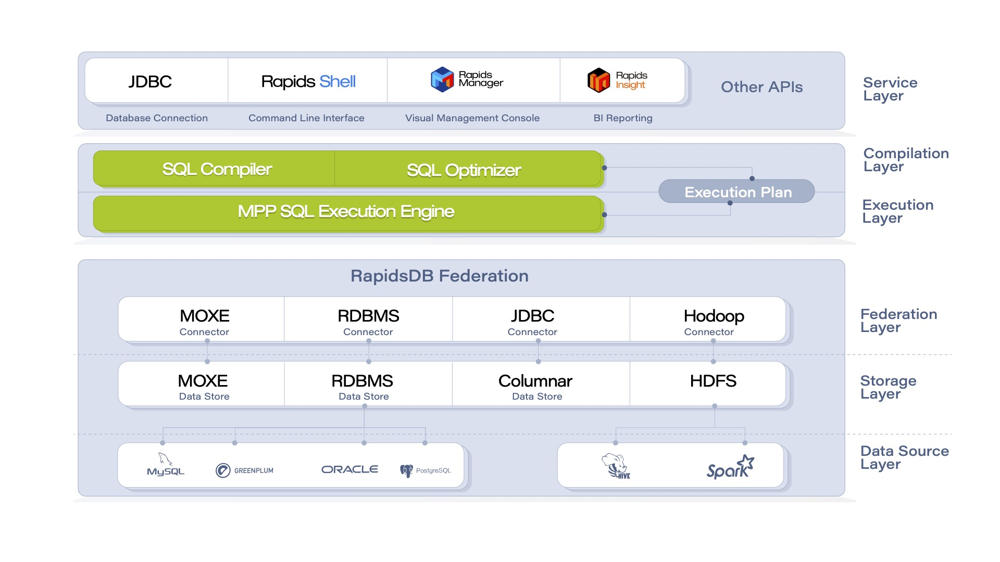

# Architecture

---

\
*RapidsDB 4.0 Technical Architecture*

From bottom to top, the technical architecture of RapidsDB consists of the following six layers:  

* **Data source layer**: with the heterogeneous data query capability through Connectors, RapidsDB can access data that resides in external data sources, such as HDFS, Hive, MySQL, etc.
* **Data storage layer**: this layer includes two built-in storage engines, which are the distributed in-memory storage engine called MOXE and a disk-based columnar data storage engine, which provide data storage, transactions, cache and log space management.  Other functions, such as data partitioning and data compression are also provided to optimize the database performance.
* **Data federation layer**: this layer creates Connectors and uniformly manages Connector functions
* **Execution layer**: RapidsDB has its own fully parallel MPP (Massively Parallel Processing) execution engine, which is responsible for executing query plans generated by the RapidsDB SQL Compiler and Optimizer. The MPP execution engine will access the underlying data sources through the RapidsDB Federation Connectors.
* **Compilation layer**：RapidsDB has an advanced SQL Compiler and Optimizer, which is responsible for query plan creation and SQL query execution. Fully leveraging the native SQL functions of the underlying data sources, the generated query plan analyzes and decides which operations can be pushed down to the data source to be executed directly. The MPP execution engine will execute the remaining parts of the query, only retrieving data from the required underlying data sources.
* **Service layer**：RapidsDB provides a command-line interface, Rapids-Shell, to configure Connectors and submit queries. It also integrates a web-based management console, RapidsDB Manager, for RapidsDB cluster configuration and management.
