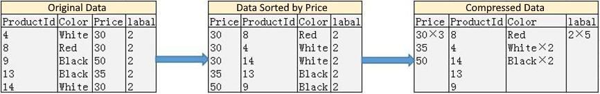

# Storage Engine

---

RapidsDB supports in-memory row stores and disk-based column stores.  The default table type of RapidsDB is row store when a table is created. If a user wants to create a column store table, an index type of the table will need to be specified. A row store is most suitable for transactional workloads while a column store is optimal for analytical workloads across large historical data.

Row-based storage is the most common data storage method of a relational database. A row store treats each row as a unit and stores all fields of a given row at the same physical location. In general, selecting, inserting, updating or deleting a single row in a table will involve changes of most or all of the columns. In RapidsDB, transactions and caching are processed in memory. By having all data stored in memory, RapidsDB completely eliminates disk I/O bottlenecks and supports fast reads and writes. Millions of rows can be scanned at lightning speed to support real-time and highly concurrent transactional workloads.

When data is too large to fit in memory or too old to be stored in memory cost-effectively, the column store provides a good hybrid data storage option.  A column store treats each column as a unit and stores data in each column at the same physical location. This method has two advantages. First, it enables each column to be stored and scanned separately. As a result, the database can just scan the columns required by a query while keeping good caching locality. Second, a column store is ideal for data compression. Column data can be sorted by selected column store index keys. Duplicated column data or similar data values can be easily compressed together to minimize the amount of data that a query needs to read from disk, generating fast query performance while reducing data storage cost to process massive data. In the following figure, the Price column is sorted and used as the index of the column store table.

\
*RapidsDB 4.0 Data Compression Workflow*

By having most write-operations performed on disk and read-operations completed in memory, RapidsDB greatly speeds up the time it takes to return a query, making querying large datasets more efficient. Furthermore, through the Rapids Federation Connector system, users can query row and column stores in the one single SQL query simultaneously. As a result, real-time data stored in the row store and historical data stored in the column store can quickly and efficiently be combined to answer a complex query, tremendously improving query performance and simplifying technical stack.
