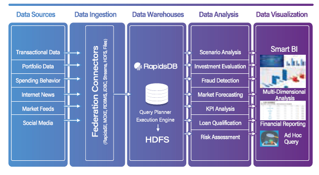

# Finance Services

---

## China Construction Bank Leverages RapidsDB to Realize A Real-Time Customer-Centric Financial Institution

### Challenges

- The current database management system creates performance bottlenecks to process large datasets in real time.
- The "market-oriented, customer-centric" business strategy requires an integration of internal and external data to have a holistic customer view.
- The online and mobile users want to access their data at any time from anywhere and get their queries responded instantly.
- Open-source software lacks professional enterprise-level support.

### Solution Highlights

- In-memory database for high performance and concurrency
- Distributed and MPP architecture for high scalability and availability
- Dynamic query optimization for unmatched query performance
- Federation for heterogenous data integration across multiple sources
- AI-in-database for intelligent data analytics
- Enterprise support to ensure reliability

### Results

- RapisDB accelerates queries on PB-level massive data more than 100x faster than the traditional data warehouse.
- China Construction Bank (CCB) is able to perform multi-dimensional analysis on a holistic view of customer data to deliver personalized products and services.
- The semantic layer of RapidsDB supports fast and secure self-service to improve the user experience.
- CCB customer service agents are able to leverage live data integration to respond to ad hoc queries in real time.
- Faster and more intelligent insights empower CCB to forecast and manage risks and prevent fraudulent activities.
- The seamless integration with the existing ecosystem provides simplicity and agility while keeping the cost down.
- No vendor lock-in to future-proof the unified big data analytics platform and truly monetize the value of data.
