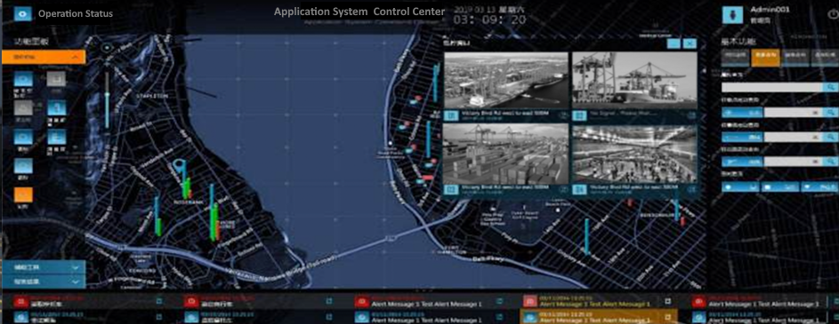

# IoT

---

## Smart Port

### Project Objectives

- To build an automatic autonomous vehicle (AV) dispatching system and improve equipment turnover efficiency
- To connect information across different systems to be able to trace and locate abnormal AV operation in real time
- To process large volumes of sensor data in real time and improve operational efficiency and optimize port services

### System Highlights

- Established the world’s first smart port that computes and analyzes AV data and detects abnormalities in real time
- Accelerated the responding speed of the AV dispatching system by 20 times
- Successfully implemented the RapidsDB streaming database and multi-source heterogenous data query engine to leverage real-time sensor data to dispatch AV automatically

### Results

- Improved port operational efficiency and resource utilization rate, greatly reducing the queuing time of container trucks
- Improved customer satisfaction and enhanced the competitive advantage of the smart port
- Improved the operations management capability of the port management company
