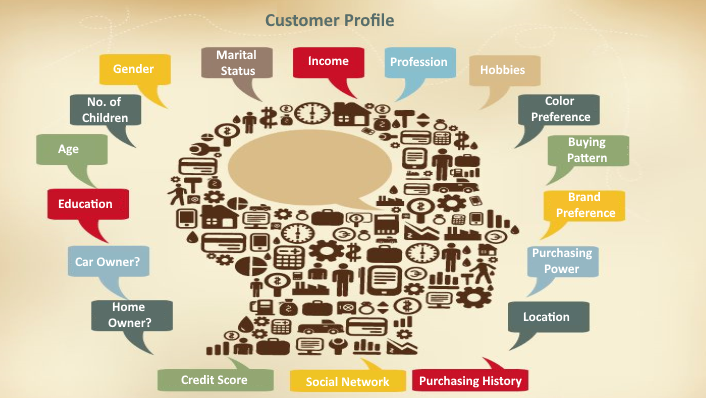
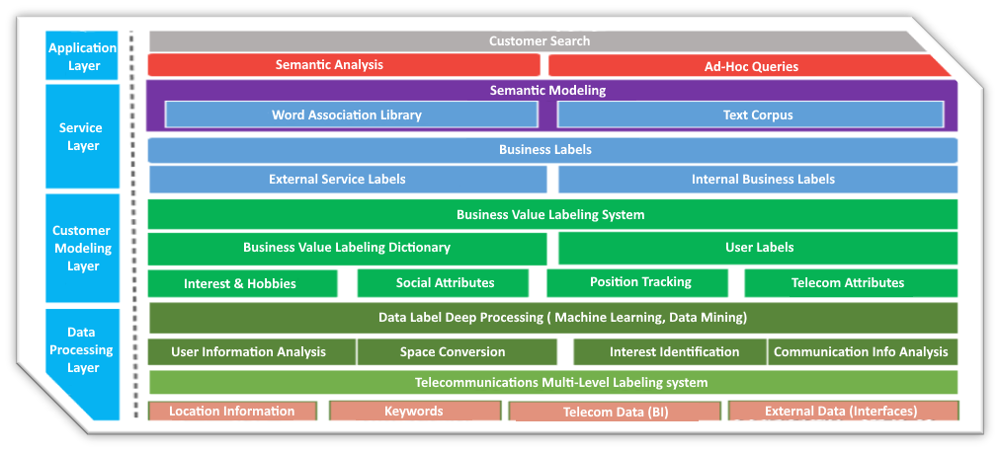

# Marketing

---

## Customer Labeling System

### Pain Points

- Manual customer labeling was based on highly-subjective decisions
- Lack of standardized customer screening processes to find best customers and lower customer churn rate
- Difficult to differentiate customers with the current analysis system, which resulted in improperly allocated enterprise resources

### System Highlights

- RapidsDB is a distributed, in-memory database
- AIworkflow integrates BI tools to provide multi-dimensional analysis
- External data is connected and federated to the unified system to provide more insights

### Results

- Established a closed-loop system to create, manage, apply and evaluate customer labels
- Helped find potential KOL users based on the insights generated by the system
- Implemented fine-grained customer screening layer, improving the promotional conversion rate by nearly 1.5%

