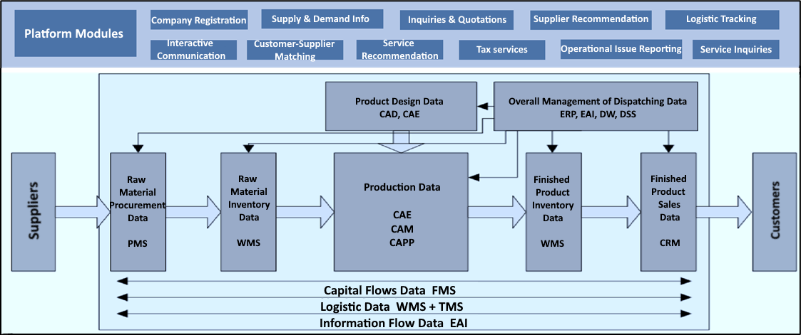

# Supply Chain Management

---

## Supply Chain Big Data Analytics Platform

### Pain Points

- Lack of a unified data management system; data resides in siloed environments; difficult to integrate all business data of the supply chain
- Not capable to keep real-time tracking of the whole supply chain processes to support urgent decision-making

### Platform Highlights

- Highly digitalized data management system
- Supply chain management process standardization and real-time data tracking and collection
- Comprehensive supply chain data analysis to support real-time business decision-making

### Results

- Reduced procurement cost
- Reduced transaction cost
- Reduced overstock inventory
- Improved inventory turnover
- Increased company revenue and profit
