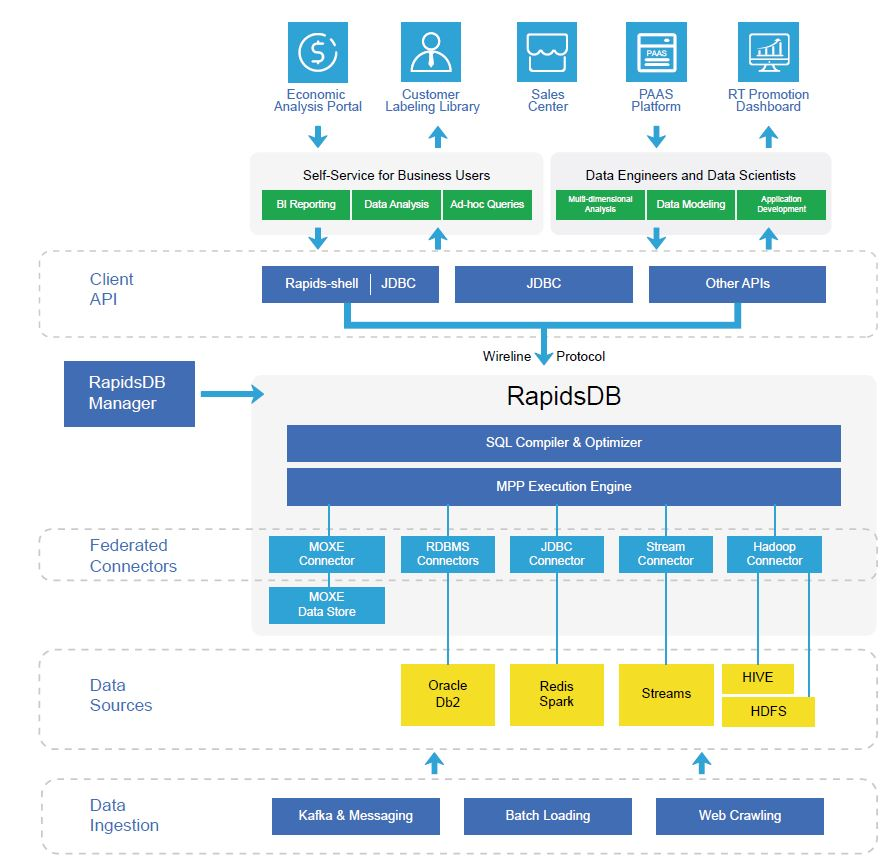

# Telecommunications

---

## China Mobile Guangdong Uses RapidsDB to Modernize Big Data Architecture and Deliver Better Customer Experience

### Challenges

The telecommunications industry generates and stores a massive amount of data. The data can be used to optimize network operations, create effective marketing strategies, drive business intelligence, and find new business opportunities to maximize company profits and improve customer experience.

However, China Mobile Guangdong (CMCC-GD)'s data is mostly distributed across disparate data systems, which includes Hadoop, Redis, Db2, Oracle, etc. While each data system has its own use cases, with the explosive increase in data volume, velocity and variety, legacy data frameworks start to reach their limit. The siloed data management environment makes it difficult and costly for CMCC-GD to access, process and analyze data in a timely manner in order to meet business objectives. The self-service capacity is very limited due to the slow query performance and a lack of a unified query language. Business users have to turn to the IT department and wait for days and months to obtain new reports and datasets. The complex big data architecture also demands a heavy workload for the IT department to maintain and ensure data security and governance.

### Requirements

What CMCC-GD needs is a modernized big data analytics platform.

- It should be able to scale easily to handle TB-level of data volume while delivering superior performance.
- It should help to accelerate the performance of the legacy systems while breaking the current bottlenecks of multiple-table joins and querying without indexing.
- It should support simple and complex queries using the standard query language of SQL, making it user-friendly to both technical and non-technical users.
- It should be able to break data silos to have a unified, enterprise-wide view of the available information and provide live data integration to support real-time data access and analytics.
- It should provide a strong self-service capability to enable users to query a relatively small amount of data by themselves and obtain the query response instantly.
- It should be able to simplify the overall data management architecture and reduce the complexity of data security and governance.

### Solution Highlights

- In-memory database
- Distributed and massively parallel processing architecture
- Unified SQL query support
- Federation for multiple data sources

### Results

- Scalability and high performance to handle massive data volume
- Columnar store to enhance query performance
- ANSI-Standard SQL support to reduce human resource cost
- Rapids federation to break data silos and simplify data governance
- Self-service capability to improve user experience
- OLTP-and-OLAP compatible hybrid database to realize real-time data processing
- Live data integration to answer ad-hoc queries
- No vendor lock-in to future proof the big data platform
