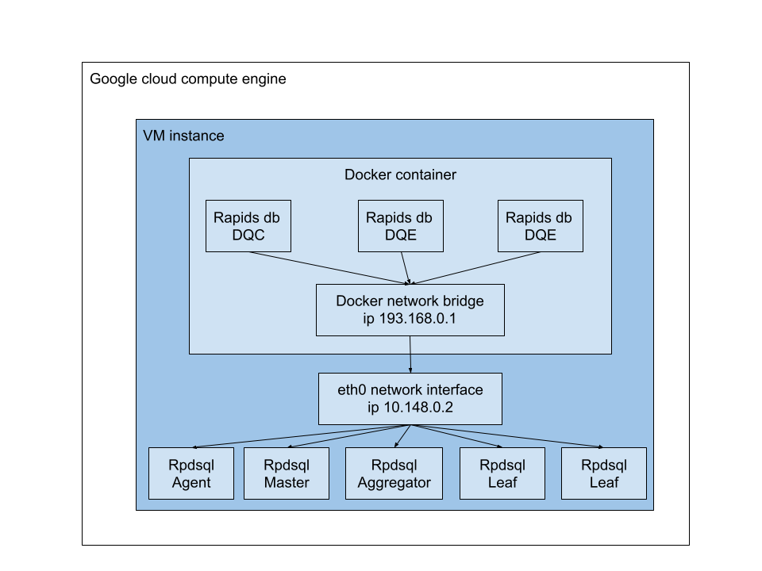

# All-in-One RapidsDB Build

---



## Create Dockerfile

```shell
#amazon os
FROM amazonlinux:latest

#rapids db using ssh passwordless to communicate
#install some system tools like netstate ps ifconfig for debug
RUN yum -y update
RUN yum -y install openssh-server openssh-clients iputils telnet tar java-1.8.0-openjdk-devel net-tools procps policycoreutils selinux-policy-targeted policycoreutils-python mariadb-devel

RUN mkdir -p /var/run/sshd
#set a default root password for debug
RUN echo root:123456 | chpasswd

#add rapids db user
RUN useradd rapids 
RUN mkdir /home/rapids/.ssh
RUN chown rapids:rapids /home/rapids/.ssh

#add passwordless key for rapids user
COPY id_rsa /etc/ssh/ssh_host_rsa_key
COPY id_rsa.pub /home/rapids/.ssh/authorized_keys
COPY id_rsa /home/rapids/.ssh/id_rsa
COPY config /home/rapids/.ssh/config
RUN chown rapids:rapids /home/rapids/.ssh/authorized_keys
RUN chown rapids:rapids /home/rapids/.ssh/id_rsa
RUN chown rapids:rapids /home/rapids/.ssh/config
RUN chmod -R go= /home/rapids/.ssh

#change sshd config to support passwordless access
RUN echo "RSAAuthentication yes" >> /etc/ssh/sshd_config
RUN echo "PubkeyAuthentication yes" >> /etc/ssh/sshd_config

RUN mkdir -p /opt/rdp
RUN chown rapids:rapids /opt/rdp 

#setup rapids db
#COPY rdp-installer-R4.2.3.1-g07cd645.run /opt/rdp/rdp-installer.run
COPY rdp-installer-R4.2.3.3-ge674a16.run /opt/rdp/rdp-installer.run

RUN chown rapids:rapids /opt/rdp/rdp-installer.run
RUN chmod +x /opt/rdp/rdp-installer.run
RUN su - rapids -c "cd /opt/rdp && ./rdp-installer.run"
RUN su - rapids -c "cp /opt/rdp/current/cfg/zk.config.sample /opt/rdp/zk.config"
RUN sed -i 's/localhost/193.168.1.1/g' /opt/rdp/zk.config
RUN su - rapids -c "cp /opt/rdp/current/cfg/cluster.config.sample /opt/rdp/cluster.config"
RUN sed -i 's/192/193/g' /opt/rdp/cluster.config

#setup rdpsql
COPY rpdsql-ops-2.0.6-dev-v.tar.gz /opt/rdp
RUN cd /opt/rdp/ && tar -vxzf rpdsql-ops-2.0.6-dev-v.tar.gz

#setup zookeeper
RUN mkdir /opt/zookeeper_data
RUN chown rapids:rapids /opt/zookeeper_data 
COPY zookeeper-3.4.12.tar /opt
RUN cd /opt && tar -xvf zookeeper-3.4.12.tar
RUN mv /opt/zookeeper-3.4.12 /opt/zookeeper 

#change zookeeper config
RUN mv /opt/zookeeper/conf/zoo_sample.cfg /opt/zookeeper/conf/zoo.cfg
RUN sed -i 's/\/tmp\/zookeeper/\/opt\/zookeeper_data/g' /opt/zookeeper/conf/zoo.cfg
RUN chown -R rapids:rapids /opt/zookeeper 

#link old lib
RUN ln -s /usr/lib64/libncurses.so.6 /usr/lib64/libncurses.so.5
RUN ln -s /usr/lib64/libtinfo.so.6 /usr/lib64/libtinfo.so.5

#open ssh port
EXPOSE 22

#open rapids db port
EXPOSE 2181
EXPOSE 4333
EXPOSE 4334

#open rapids db agent port
EXPOSE 9999

#open rapids db rdpsql port
EXPOSE 3306
EXPOSE 3307
EXPOSE 3308
EXPOSE 3309

##update license
COPY rapidsforcloud.lic /opt/rdp/rapidsforcloud.lic
RUN chown rapids:rapids /opt/rdp/rapidsforcloud.lic
#RUN su - rapids -c "cd /opt/rdp/current && ./bootstrapper.sh -a COPY_LICENSE -l /opt/rdp/rapidsforcloud.lic"
#RUN su - rapids -c "cd /opt/rdp/current && ./bootstrapper.sh -a install -i ../rdp-installer.run -l ../rapidsforcloud.lic"

##start zookeeper and sshd for once to update license
#COPY install_license.sh /opt/rdp
#RUN chmod +x /opt/rdp/install_license.sh
#RUN cd /opt/rdp && ./install_license.sh


#run multi program at background and monitor them
COPY run_script.sh /opt/run_script.sh
RUN chmod +x /opt/run_script.sh

#start sshd and zookeeper
CMD /opt/run_script.sh
```

## Create docker-compose.yml

```yml
version: "2"
services:
  dqc:
    image: rapidsdb:2
    container_name: dqc
    build: .
    networks:
        rapids_net:
            ipv4_address: 193.168.1.1
    ports:
        - "14333:4333"
        - "14334:4334"
        - "11122:22"
        - "12181:2181"
        - "19999:9999"
  dqe1:
    depends_on:
      - dqc
    image: rapidsdb:2
    container_name: dqe1
    networks:
        rapids_net:
            ipv4_address: 193.168.1.2

  dqe2:
    depends_on:
      - dqc
    image: rapidsdb:2
    container_name: dqe2
    networks:
        rapids_net:
            ipv4_address: 193.168.1.3

  dqr:
    depends_on:
      - dqc
      - dqe1
      - dqe2
    image: rapidsdb:2
    command: >
        bash -c "sleep 5 && ssh -i /home/rapids/.ssh/id_rsa -o 'StrictHostKeyChecking no' rapids@193.168.1.1 'cd /opt/rdp/current && ./bootstrapper.sh -a install -i ../rdp-installer.run -l ../rapidsforcloud.lic && ./bootstrapper.sh -a start'"
    container_name: dqr
    networks:
        rapids_net:
            ipv4_address: 193.168.1.4

networks:
  rapids_net:
    name: rapids_net
    driver: bridge
    ipam:
     config:
       - subnet: 193.168.1.0/16
         gateway: 193.168.0.1
```
