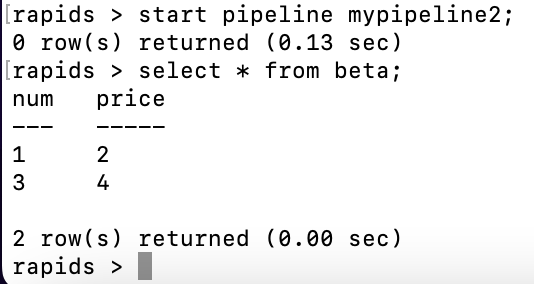

# KAFKA RPDSQL Pipeline

---

## KAFKA env build

follow this document (make sure the ip address in compose yml is your host ip)

* [kafka offical docker page](https://developer.confluent.io/quickstart/kafka-docker/)

create topic then put some message

```shell
[root@ip-10-1-24-240 kafka]# docker exec --interactive --tty broker \
> kafka-console-producer --bootstrap-server broker:9092 \
>                        --topic quickstart
>1,2
>3,4
```


## run testing

```sql
create table beta (num VARCHAR(20), price VARCHAR(20));

CREATE PIPELINE `mypipeline` AS LOAD DATA KAFKA '10.1.24.240:9092/quickstart'
INTO TABLE beta
FIELDS TERMINATED BY ',' ENCLOSED BY '' ESCAPED BY '\\'
LINES TERMINATED BY '\n' STARTING BY '';

test pipeline mypipeline;

show pipelines;

start pipeline mypipeline;
```



