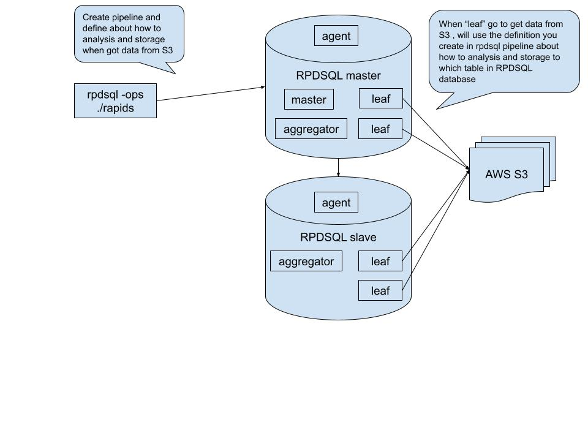
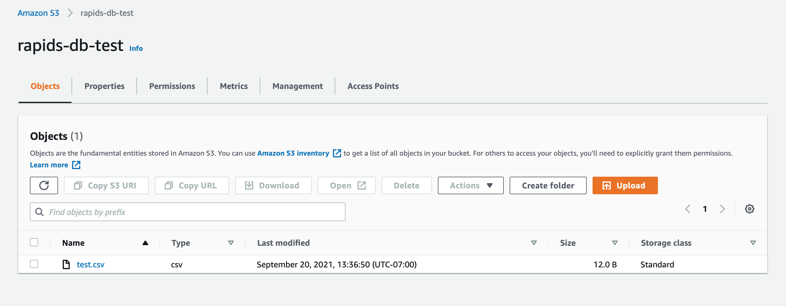
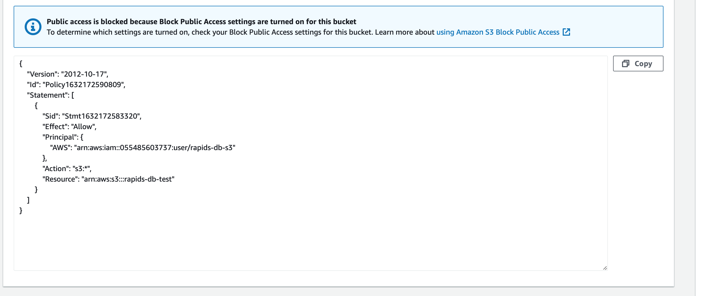
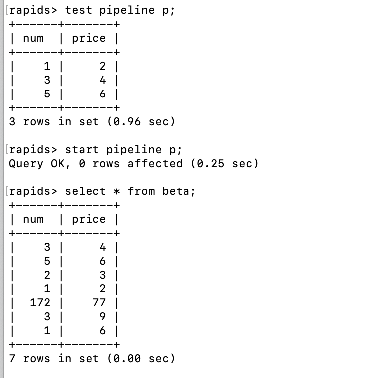

# AWS S3 RPDSQL Pipeline

---

## Architecture



## Set Up AWS S3 Bucket

Create an S3 bucket, and upload a test file:

test.csv

```text 
1,2
3,4
5,6
```



Create bucket policy:



## Create Pipeline

You must log in to RPDSQL database first (not RapidsDB), using rpdsql-ops/rapids command (not Rapids Shell).

```sql
create table beta (num VARCHAR(20), price VARCHAR(20));

CREATE PIPELINE p AS LOAD DATA
S3 'rapids-db-test'
CONFIG '{"region": "ap-southeast-1"}'
CREDENTIALS '{"aws_access_key_id": "key_id", "aws_secret_access_key": "secret_key"}'
SKIP DUPLICATE KEY ERRORS
INTO TABLE beta
FIELDS TERMINATED BY ',' ENCLOSED BY '' ESCAPED BY '\\'
LINES TERMINATED BY '\n' STARTING BY '';

test pipeline p;

show pipelines;

start pipeline p;

```

## Test and Run Pipeline



After creating and running the pipeline in the RPDSQL database, the AWS S3 data should be transferred into RPDSQL database. Then you can use RapidsDB connector to load data from RPDSQL database and do your data analysis.
