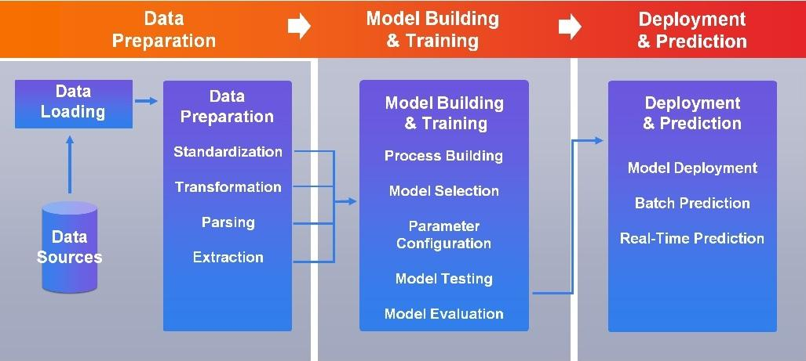
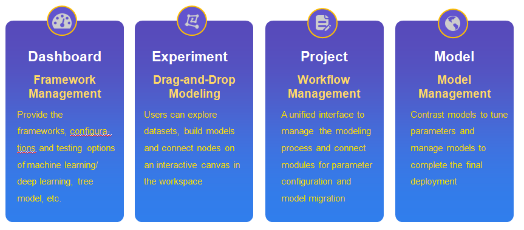

# AIworkflow

---

AIworkflow, the core technology of ParallelAI, is a unified AI management platform that significantly simplifies the machine learning modeling process.

* It provides a visual, drag-and-drop interface for both developers and business users to experiment, build, train and deploy machine learning models without requiring any specific programming skills
* It provides a unified modeling platform, which integrates multiple machine learning and deep learning frameworks
* It covers the whole data modeling lifecycle, which includes data ingestion, preparation, modeling, training, testing, evaluation, deployment and prediction
* It provides a process management component, Project, to increase the reusability and portability of the modeling process
* It provides a modeling management component, Model, to support automatic model contrast and make parameter tuning and model deployment more convenient

\
*Data Processing Pipeline of AIworkflow*

\
*Components of AIworkflow*

With AIworkflow, model building, testing, and deployment time can be greatly reduced as well as the IT O&M cost. It helps modern corporations improve data modeling efficiency, maximize productivity, optimize customer experience and boost data-driven innovation, speeding up business decisions and making it possible to monetize data value in real time.
